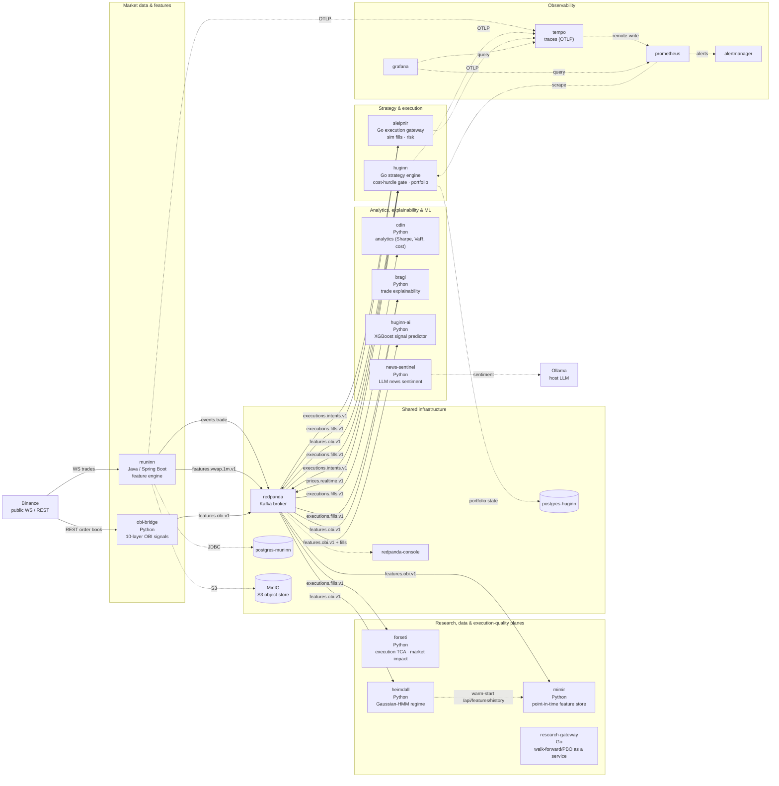
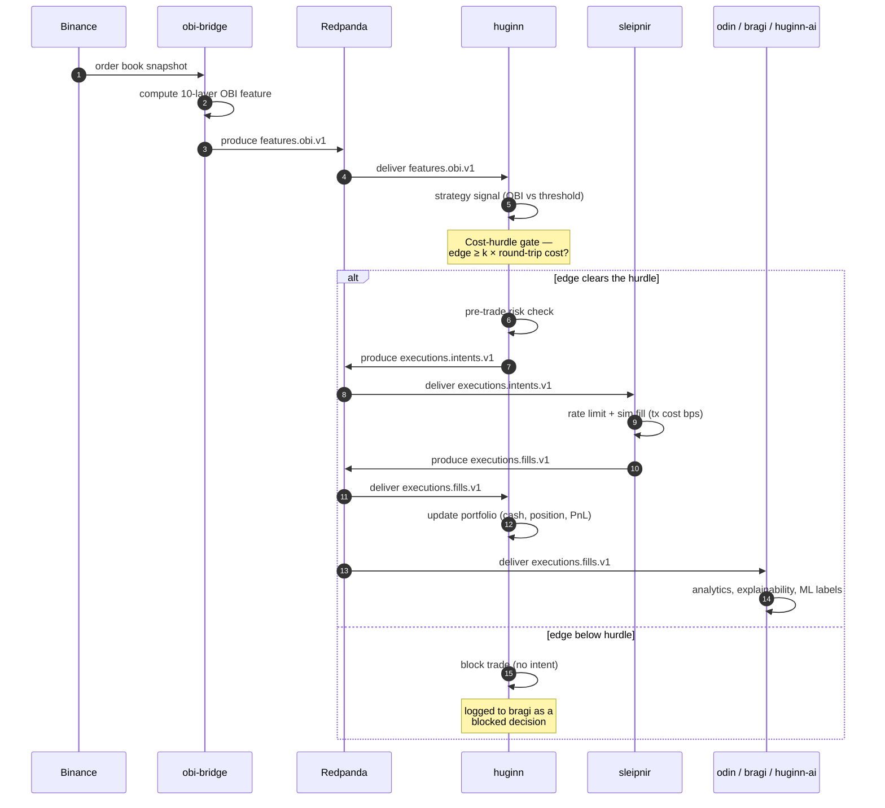

# Architecture

The Norse Stack is a local, end-to-end quantitative trading **simulation**: real
(unauthenticated) Binance public market data flows through feature computation, a
cost-aware strategy engine, and a simulated execution gateway, with analytics,
ML, and full observability layered on top. Execution is **sim-only** — no orders
ever reach a real exchange.

This document is the source of truth for the topology. GitHub renders the
[`mermaid`](https://github.blog/2022-02-14-include-diagrams-markdown-files-mermaid/)
blocks below natively, so no external renderer is needed. Keep it in sync with
[`docker-compose.yml`](../docker-compose.yml) and
[`scripts/provision-topics.sh`](../scripts/provision-topics.sh) (the Kafka topic
contracts are documented in [`CONTRACTS.md`](CONTRACTS.md)).

## Container topology

The 21 long-running services from `docker-compose.yml` (the full stack is 23
containers — `topic-init` and `minio-init` are one-shot bootstrap jobs that
provision Kafka topics / the MinIO bucket and then exit, so they are omitted here).
Solid edges are Kafka topics (labelled with the topic name); dashed edges are
synchronous calls (HTTP/gRPC, JDBC, S3, OTLP) or scrapes.

### Why two feature producers?

- **muninn** is the durable, deterministic feature engine: it ingests raw
  Binance trades, computes windowed features (e.g. `features.vwap.1m.v1`), and
  persists raw + warehouse data to Postgres and MinIO for replay and research.
- **obi-bridge** is the low-latency live path that feeds the strategy. It polls
  the Binance order book and emits 10-layer order-book-imbalance (OBI) features
  on `features.obi.v1`, which is the topic **huginn** actually trades on.

## Single-trade sequence

How one OBI feature event becomes a fill and lands in the portfolio and
analytics. The **cost-hurdle gate** is the load-bearing step: huginn only emits
an intent when the expected net-of-cost edge clears `COST_HURDLE_K x` round-trip
cost (fees + slippage). On the 24h fixture, `k=1` flipped realized PnL from
-59 (235 fills) to +1 (32 fills) by killing fee-bleeding marginal trades — see
[`RESULTS.md`](RESULTS.md).

## Ports & topics

Full port map lives in [`../CLAUDE.md`](../CLAUDE.md); Kafka topic partition /
retention / cleanup contracts live in [`CONTRACTS.md`](CONTRACTS.md) and are
provisioned by [`../scripts/provision-topics.sh`](../scripts/provision-topics.sh).

| Topic | Producer | Consumers |
|-------|----------|-----------|
| `events.trade` | muninn | (warehouse / replay) |
| `features.vwap.1m.v1` | muninn | (warehouse / replay) |
| `features.obi.v1` | obi-bridge | huginn, bragi, huginn-ai |
| `prices.realtime.v1` | huginn | (live exit monitoring) |
| `executions.intents.v1` | huginn | sleipnir |
| `executions.fills.v1` | sleipnir | huginn, odin, bragi, huginn-ai |
