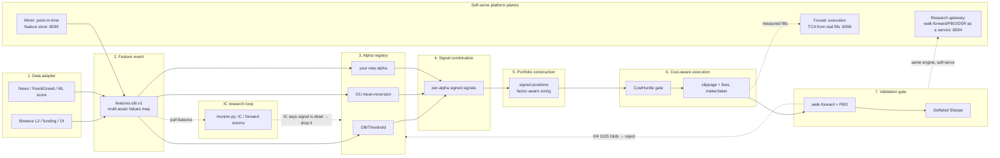

# Norse Stack as a Quant Alpha Platform

This page reframes Norse Stack for an engineering reviewer: not as a trading bot,
but as an **extensible quant-alpha research-and-execution platform** — the rails a
quant research team actually works on. The point is to show *where you plug in*
when you have a new data source, a new signal, a new portfolio construction rule,
or a new risk model — and that the platform tells you, honestly and automatically,
when a signal is dead.

> The headline result on this dataset is that the bundled signals have **no
> out-of-sample edge** ([`EDGE_VERDICT.md`](EDGE_VERDICT.md)). That is the platform
> *working*: the validation gate killed an overfit signal before any capital was at
> risk. A platform that can prove a negative is more valuable than a backtest that
> only ever prints green.

## The pipeline a quant team extends

## Stage-by-stage: where the extension points are

### 1. Data adapter — *add a new data source here*

A source adapter turns an external feed into a deterministic feature event. The
live feature event `features.obi.v1` already carries a **multi-asset universe**
(BTC/ETH/SOL/XRP/DOGE) in a rich `Values` map: `obi`, `midPrice`, `microPrice`,
`spread`, `momentum`/`momentum1m`/`momentum15m`, `emaFast`/`emaSlow`,
`volatility`, plus `funding`, `openInterest`, `fearGreed`, `mlScore`,
`newsSentiment`.

- **Extension point:** add a field to the `Values` map (a new source adapter in
  Muninn / the OBI bridge). Existing alphas ignore unknown keys, so this is
  additive.
- **Code:** [`services/obi-bridge`](../services/obi-bridge), Muninn's
  [ADR-0008 multi-exchange adapter framework](https://github.com/lgreene03/muninn/blob/main/docs/adr/0008-multi-exchange-adapter-framework.md).
- **Why it matters:** a new alpha consuming a new `Values` field is the whole
  data-extensibility story — no schema migration, no recompile of unrelated
  strategies.

### 2. Feature event — the deterministic contract

Everything downstream is a pure function of one `model.FeatureEvent`. Strategies
read `EventTime`, never wall-clock time, so a backtest and a live run share one
computation path (deterministic replay parity).

- **Code:** the event/contract is documented in
  [`docs/CONTRACTS.md`](CONTRACTS.md); replay determinism is enforced by
  [`huginn/internal/backtest/parity_test.go`](https://github.com/lgreene03/huginn/blob/main/internal/backtest/parity_test.go).

### 3. Alpha registry — *add a new signal here* (the primary extension point)

Every signal is a `Strategy` implementation: one method,
`OnFeature(model.FeatureEvent) []model.Order`. New alphas are self-contained files
in `huginn/internal/strategy/` and are wired in at boot — adding one does not touch
the existing OBIThreshold or OU strategies.

- **Interface:** [`huginn/internal/strategy/strategy.go`](https://github.com/lgreene03/huginn/blob/main/internal/strategy/strategy.go).
- **Worked examples:** [`obi_threshold.go`](https://github.com/lgreene03/huginn/blob/main/internal/strategy/obi_threshold.go)
  (microstructure heuristic) and [`ou_reversion.go`](https://github.com/lgreene03/huginn/blob/main/internal/strategy/ou_reversion.go)
  (a fitted price-process model with a half-life exit and trend-guard).
- **How-to:** [`ADDING_AN_ALPHA.md`](ADDING_AN_ALPHA.md) — the step-by-step recipe
  for shipping a new signal through the whole pipeline.

### 4. Signal combination — *change how signals blend here*

Each alpha emits a signed signal. Combination today is one-alpha-per-deployment;
the extension point for multi-signal blending (rank/weight/orthogonalize before
sizing) is the boundary between the strategy output and portfolio construction.

- **Code:** position sizing logic in
  [`huginn/internal/strategy/sizing.go`](https://github.com/lgreene03/huginn/blob/main/internal/strategy/sizing.go).

### 5. Factor-aware portfolio construction — *add a risk model / sizing rule here*

Orders feed a **signed-position portfolio** (long *and* short, not long-only) with
realized/unrealized PnL tracking. This is where factor exposures and risk-aware
sizing are applied before anything reaches the executor.

- **Code:** `huginn/internal/portfolio` (signed positions) and
  `huginn/internal/risk` (drawdown, daily-loss, position/notional caps,
  staleness watchdog).
- **Research side:** factor/IC analysis lives in **muninn-py** —
  `information_coefficient`, `forward_returns`, `rolling_corr`, `hit_rate` (pure
  Polars-in/Polars-out functions), demonstrated end-to-end in
  [`muninn-py/notebooks/alpha_backtest_demo.ipynb`](https://github.com/lgreene03/muninn-py/blob/main/notebooks/alpha_backtest_demo.ipynb)
  and the bundled Streamlit dashboard. This is the IC research loop that tells you
  a signal is worth carrying *before* you wire it into the engine.

### 6. Cost-aware execution — already built, reuse it

The `CostHurdle` gate rejects net-negative marginal trades before they fill; the
executor models slippage and maker/taker fees on a separate service boundary
(Sleipnir runs a sim exchange by default).

- **Code:** [`huginn/internal/strategy/cost_hurdle.go`](https://github.com/lgreene03/huginn/blob/main/internal/strategy/cost_hurdle.go),
  `huginn/internal/executor`,
  [ADR-0002 sim-only execution boundary](adr/0002-sim-only-execution-boundary.md).
- **Honest framing:** the gate is *damage control*, not alpha — it cannot
  manufacture edge a signal does not have. See `EDGE_VERDICT.md`.

### 7. Validation gate — *the part that keeps you honest*

Before any signal is trusted it goes through **anchored walk-forward** (expanding
train, sliding test) with a **Probability of Backtest Overfitting (PBO)** score and
a **Deflated Sharpe** check. Parameters are chosen on the train window only and
applied to unseen test windows.

- **Code:** [`huginn/cmd/walkforward`](https://github.com/lgreene03/huginn/blob/main/cmd/walkforward/main.go),
  [ADR-0007 walk-forward calibration](https://github.com/lgreene03/huginn/blob/main/docs/adr/0007-walk-forward-calibration-workflow.md).
- **What it found:** OBI scored **0/4 profitable OOS folds, PBO = 1.00**; OU
  scored the same with a smaller loss. Both were rejected. That rejection is the
  platform delivering its core value: it tells you a signal is dead so you stop
  tuning it and move on to better data or a different signal.

## The platform planes: research, data, and execution-quality as services

The seven stages above are the *pipeline*. Three standalone services turn the
rigor of that pipeline into **self-serve platform planes** — capabilities a quant
can hit over HTTP without touching the live trading process. Each one hardens a
different axis of honesty.

### Research gateway — the validation/research plane (`huginn` cmd/research, port 8094)

Walk-forward + PBO + Deflated-Sharpe validation, run **as a service, out of the
live trading process**. It reuses `huginn/internal/research` — the *same* engine
[`cmd/walkforward`](https://github.com/lgreene03/huginn/blob/main/cmd/walkforward/main.go)
uses — so a validation run from the gateway and a run from the CLI share one code
path. Submit a job with `POST /api/research/runs`, poll it with
`GET /api/research/runs/{id}`, list with `GET /api/research/runs`.

- **The point:** validation rigor is a **first-class, self-serve capability**, not
  a one-off script someone has to remember to run. And it reproduces the honest
  result — OBI still scores **0/4 profitable OOS folds, PBO = 1.00, total OOS PnL
  -146.11**. The gate's verdict is the same whether you reach it from the CLI or
  the gateway, which is exactly the property you want.

### Mimir — the point-in-time data plane (port 8095)

A **point-in-time (no-lookahead) feature store.** Every record is stamped with
both an `event_time` (when the fact was true in the market) and an `ingest_time`
(when the platform learned it). An as-of query
(`GET /api/features?as_of=<t>`) returns **only data that was known at instant `t`**
— never a value the platform had not yet ingested. History is auditable via
`GET /api/features/history`, and data sources are enumerated via
`GET /api/sources`.

- **The point:** this prevents the **#1 backtest sin — lookahead bias — at the
  data layer**, structurally, instead of trusting every researcher to avoid it by
  hand. It also makes "onboard a new data source" concrete: register a source,
  let Mimir replay the topic and stamp a fresh `ingest_time`, and every downstream
  as-of query inherits the no-lookahead guarantee for free. It is the data-plane
  complement to the deterministic-replay parity the feature event already gives.

### Forseti — the execution-quality plane (port 8096)

**Transaction-cost analysis (TCA) computed from real fills:** realized slippage,
maker vs. taker classification, fees, and implementation shortfall. Query the
aggregate with `GET /api/tca` and the underlying fills with `GET /api/tca/fills`.
Crucially, Forseti **never fabricates a benchmark** — when there is no arrival
price to measure against (as on simulated/paper fills), it reports the slippage
figure as **`null`** rather than inventing a flattering number.

- **The point:** Forseti **measures whether the `CostHurdle` gate actually works**.
  Stage 6 *claims* to reject net-negative trades; Forseti is the independent
  meter that tells you, from realized fills, whether the cost story held up in
  execution. That is execution-quality rigor — and the honest-null behavior is the
  same discipline as the walk-forward gate: the platform refuses to print a number
  it cannot actually back with data.

Together these are the same "prove it, honestly" ethic as the validation gate,
projected onto three planes: **research** (is the edge real?), **data** (is the
input free of lookahead?), and **execution** (did the costs behave as modeled?).

## The loop, in one sentence

Pull features → measure IC in muninn-py → if promising, implement a `Strategy` →
size it into the signed-position portfolio → gate every trade on net-of-cost →
**prove or disprove edge with walk-forward + PBO** → keep or kill. Adding a new
data source, signal, or risk model touches one self-contained extension point; the
validation gate is non-negotiable and applies to all of them equally.

## See also

- [`ADDING_AN_ALPHA.md`](ADDING_AN_ALPHA.md) — the concrete recipe.
- [`EDGE_VERDICT.md`](EDGE_VERDICT.md) — the honest no-edge result and why it is a
  feature.
- [`ARCHITECTURE.md`](ARCHITECTURE.md) — the 22-container service topology.
- [`RESULTS.md`](RESULTS.md) — full unedited backtester/walk-forward output.
